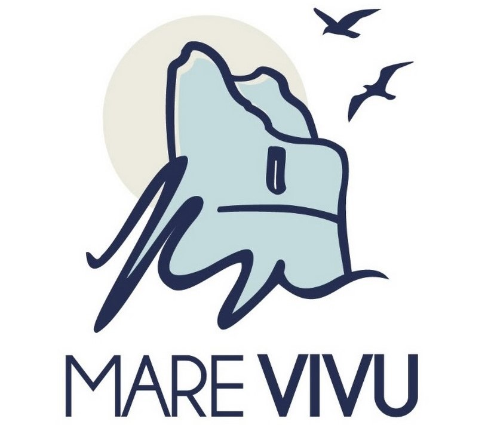
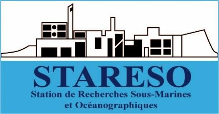

# riparuR

## Description 
Ce projet contient les scripts de traitement des données du suivi RIPARU de l'Association [Mare Vivu](https://www.mare-vivu.org/).

## Contexte
Le projet **RIPARU** (Recherche Intégrée pour la Prévention en Amont des Résidus plastiqUes) a pour objectif de caractériser les déchets échoués sur les plages de Corse au sein du Parc Naturel Marin du Cap Corse et de l'Agriate (PNMCCA) afin de notamment caractériser les plages par leurs compositions en macrodéchets et en microplastiques. Il rassemble un grand nombre de plages suivies en Corse (principalement Haute-Corse), dont quelques unes suivies régulièrement dans l'enceinte du PNMCCA.

### Macrodéchets
Les prélèvements de macrodéchets sont effectués aux **4 saisons** de l'année et sur **7 sites** depuis 2022. Les campagnes permettent de collecter et d'identifier le plus précisément possible les déchets. Les plages concernées par les collectes régulières de macrodéchets sont :

-   Macinaghju
-   Barcaghju
-   Alisu
-   Ferringule
-   La Roya
-   Saleccia
-   Petracurbara

Les données de dénombrement par type de déchets sont ensuite saisies sur la plateforme **MerTerre** qui sert non seulement de base de données centralisée mais permet aussi d'exporter un jeu de données dans lequel les déchets sont classifiés en catégories spécifiques. Les grandes méthodes de classifications sont :

-   **Filières REP** : Filières à Responsabilité Elargie des Producteurs. Ces filières permettent de mettre en oeuvre le principe de pollueur-payeur. Identifier les filières REP permet de cibler les producteurs responsables de la mise sur le marché des produits à l'origine des déchets.

-   **Secteurs d'activité** : Les secteurs d'activité permettent de cibler les sources potentielles de déchets. Les déchets sont classifiés en fonction de leur origine.

-   **DCSMM** : La DCSMM (Directive Cadre Stratégie pour le Milieu Marin) est une directive européenne qui vise à protéger le milieu marin. Les déchets sont classifiés selon les catégories indiquées par la DCSMM.

-   **Groupes Zéro Déchet Sauvage** : La classification établie par le protocole du réseau Zéro Déchet Sauvage permet de regrouper les déchets en fonction de leur nature, de manière assez fine.

-   **Marques** : Les marques des produits permettent par exemple de cibler des origines spécifiques des déchets ou de catégoriser les plages par type de personnes les fréquentant.

### Microplastiques

De manière similaire aux macrodéchets, les **microplastiques** sont collectés sur 8 plages aux 4 saisons de l'année depuis 2022. Lors du cas de plages aux collectes comportant à la fois les microplastiques et les macrodéchets, les prélèvements sont réalisés à la même journée. Les plages concernées par les collectes régulières de microplastiques sont :

-   Barcaghju
-   Ferringule
-   Saleccia
-   La Roya
-   Lozari
-   Macinaghju
-   L'Ostriconi
-   Petracurbara

Les plastiques sont distingués en deux classes de taille, distinction qui correspond à la séparation par les tamis aux mailles définies. Les **microplastiques** sont de taille comprise entre 1 et 5 mm et les **mésoplastiques** de taille supérieure à 5 mm. Outre la taille des éléments plastiques récupérés, les types de plastiques sont classifiés dans des catégories distinctes.

## Structure

### Données
Les données sont situées dans le dossier **data**, divisé en sous-dossiers :
- **raw** pour les fichiers sources
- **processed** pour les fichiers corrigés et utilisables pour les analyses

Les données sources correspondent :
- Aux suivis des macrodéchets
- Aux suivis des microplastiques
- A la typologie des plages

### Scripts d'analyse
Les scripts principaux sont contenus dans le dossier **main** et correspondent chacun à une étape d'analyse. Ce dossier *main* contient notamment le script *riparu_preprocessing* qui permet de passer des jeux de données sources excel aux jeux de données exploitables, utilisés par tous les autres scripts d'analyse du dossier *main*.

### Scripts de support
Les scripts de supports sont contenus dans le dossier **R**. Ils sont appelés dans les autres scripts grâce à la fonction *source()*. Ces scripts de support correspondent notamment :
- Au script *paths.R* qui permet de rassembler tous les chemins d'accès locaux du projet à un seul endroit. Ainsi, en cas de changement de fichier source ou de nom de fichier, les chemins d'accès sont mis-à-jour pour l'intégralité des scripts. Tous les chemins d'accès sont enregistrés dans la variable *paths*. Il suffit donc d'accéder à un chemin d'accès en saisissant *paths$nom_de_la_variable_chemin_voulue* avec le nom de la variable chemin visible dans le script *paths.R*
- Au script *constants.R* qui peut contenir les constantes utilisables pour tous les scripts
- A tous les scripts de fonctions de support identifiables par le suffixe *fct_*. Ces scripts contiennent des fonctions enlevées des scripts principaux pour plus de clareté de lecture

### Sorties & Figures
Le dossier **output** contient les sorties & figures générées par les scripts, en structuration par sous-dossiers par thèmes. Ce dossier n'est visible qu'après execution du code en local, les figures n'étant pas synchronisées sur git & github.

### Rapport Quarto
Le dossier **quarto** contient les éléments permettant de générer un rapport sous format html interactif. Il a été construit en 2024 pour un premier rendu d'analyses de données en parallèle de la construction d'un shiny interactif.

### Autres
Les autres fichiers et dossiers à la racine du projet correpondent aux utilitaires du projet :
- riparu_analyses.Rproj --> pour ouvrir le projet sous Rstudio
- README --> pour générer cette description
- .lintr --> paramètres de lintr, package de vérification de bonnes pratiques d'écriture sous R
- .gitigore --> pour éviter la mise à jour de fichiers non voulus sur git
- renv & renv.lock --> pour le package renv permettant de controller les versions des packages utilisés dans le projet

## Contributeurs 

Création du projet RIPARU : 
- Pierre-Ange Guidicelli - Mare Vivu

Gestion de projet RIPARU : 
- Lea Bourglan (2022-2024) - Mare Vivu
- Céline Sénécaut (2024-2025) - Mare Vivu

Analyse - architecture et code R : 
- Aubin Woehrel - STARESO
